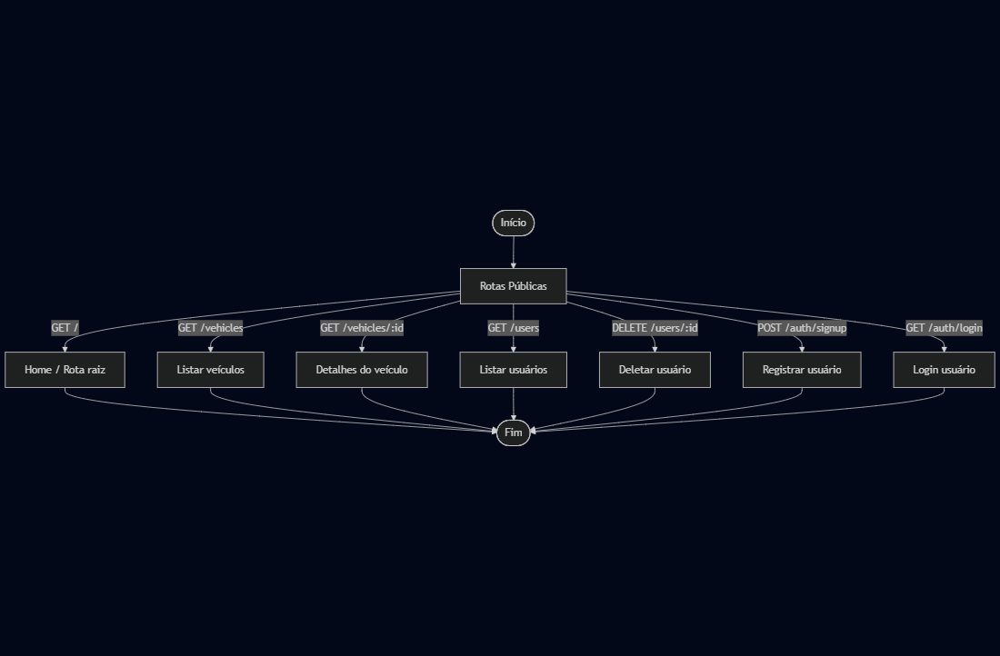
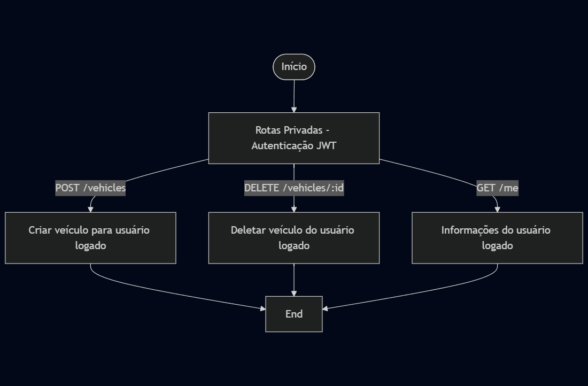

# API de Controle de Veículos

API desenvolvida em **Node.js** que simula o gerenciamento de usuários e veículos, com autenticação JWT.




## 🚀 Funcionalidades

- Cadastro e autenticação de usuários (JWT)
- CRUD de veículos e usuários
- Validação de dados com `express-validator`
- Armazenamento em MongoDB

## 🛠️ Tecnologias

- Node.js
- Express
- MongoDB
- Docker

## 🔗 Dependências e Versões Necessárias
- Docker - Versão: 24.x ou superior
- Node.js - Versão: 18.x ou superior
- MongoDB - Versão: 6.x (via container Docker)

## 🏃 Como rodar o projeto
Siga os passos abaixo:

1. Clone o repositório:
```
git clone https://github.com/natb3lo/api-controle-de-veiculos.git
```
2. Vá para o diretório do projeto:
```
cd api-controle-deveiculos
```
3. Crie seu arquivo de variáveis de ambiente a partir do `.env.example`
```
cp .env.example .env
```
4. Preencha os valores necessários no arquivo `.env`(ex: `DB_HOST`, `DB_NAME`, `SECRET`)

5. Suba os containers da aplicação e do MongoDB usando Docker Compose:
```
docker compose up --build
```
6. A API estará disponível em `http://localhost:3000`
Verifique os logs do container ou acesse a rota principal (GET /) para confirmar que está rodando.

## 📌 Rotas da API

- GET / → Rota de boas vindas da API (Rota pública)

- GET /auth/login → Realizar login (Rota pública)

- POST /auth/signup → Cadastrar usuário (Rota pública)

- GET /users → Listar usuários (Rota pública)

- POST /users → Criar usuário (Rota pública)

- DELETE /users/:id → Remover usuário (Rota pública)

- GET /me → Retornar usuário logado (Rota privada)

- POST /vehicles → Criar veículo para usuário logado (Rota privada)

- GET /vehicles → Listar veículos (Rota pública)

- GET /vehicles/:id → Listar veículo (Rota pública)

- DELETE /vehicles/:id → Remover veículo do usuário logado (Rota privada)

## ⏭️ Próximos passos

- Implementar rotas de atualização (PATCH /users/:id, PATCH /vehicles/:id)

- Adicionar paginação e filtros para listagem de veículos

- Criar testes unitários e de integração completos

- Configurar ambiente de produção com Docker e CI/CD

## 📁 Arquivos importantes

- `dockerfile` → define a imagem da aplicação Node.js

- `docker-compose.yaml` → orquestra a API e o MongoDB

- `.env.example` → modelo de variáveis de ambiente, sem valores sensíveis

- Código fonte → controllers/, database/, middlewares/, models/, routes/, server.js

